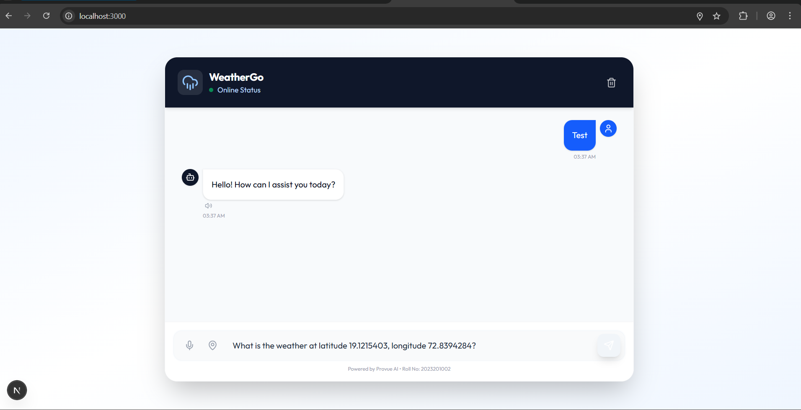

# WeatherGo 🌦️

**WeatherGo** is a state-of-the-art, AI-powered weather assistant designed to revolutionize how users interact with weather data. Built with the latest web technologies, it replaces traditional dashboard-style (or "card-style") interfaces with a conversational, natural language experience.

Instead of navigating through complex charts or dropdowns, users simply *ask* for what they need—whether it's the current temperature in London, a forecast for the weekend, or specific climate details—and receive an intelligent, formatted response instantly.

## 📸 Screenshots

*The main chat interface showing a conversation with the AI Agent, featuring the new high-visibility blue user bubbles and typewriter-style agent responses.*

## 🚀 Key Features

### 🧠 Intelligent Conversational Core
At the heart of WeatherGo is a sophisticated AI agent capable of understanding natural language queries.
*   **Contextual Understanding**: The agent remembers the flow of conversation. You can ask "What's the weather in Paris?" followed by "What about tomorrow?" without restating the city.
*   **Rich Text Formatting**: Responses are not just plain text. They are beautifully rendered using Markdown, supporting lists, bold text for emphasis, and organized data structures for readability.
*   **Error Handling**: The system gracefully handles API failures or misunderstood queries, guiding the user back to a helpful path.

### 🎨 Modern & Responsive UI
The application features a "Glassmorphism" inspired design with a clean, light-themed aesthetic.
*   **Dynamic Message Bubbles**: User messages stand out in vivid blue for high contrast, while agent responses appear in a clean card style.
*   **Typewriter Animation**: To mimic a real-time thinking process, agent responses stream in character-by-character.
*   **Fully Responsive**: Whether accessed on a 4K desktop monitor or a mobile phone, the layout adapts fluidly.

### 🛠️ Advanced Functionality
*   **🎤 Voice Input (Speech-to-Text)**: Don't want to type? Click the microphone icon. using the Web Speech API, WeatherGo converts your spoken words into text instantly.
*   **🗣️ Text-to-Speech (Agent Voice)**: The agent can "speak" its forecast to you. A speaker icon on every agent message triggers the browser's native synthesis engine.
*   **📍 Instant Geolocation**: A dedicated "Map Pin" button allows you to instantly ask for the weather at your exact longitude and latitude, perfect for traveling.

## 💻 Technology Stack

This project leverages a modern, robust stack to ensure performance, scalability, and developer experience:

*   **Next.js 15 (App Router)**: The framework of choice for React, providing server-side rendering and efficient routing.
*   **React 18**: for building a dynamic, component-based user interface.
*   **Tailwind CSS v4**: For utility-first styling, enabling rapid UI development and easy theming.
*   **Lucide React**: A beautiful library of consistent, lightweight icons.
*   **Framer Motion**: Powering the smooth entry animations of message bubbles and loading indicators.
*   **React Markdown & Remark GFM**: For rendering complex, rich-text AI responses safely.

## 📂 Project Structure

A quick look at how the code is organized:

```
src/
├── app/
│   ├── layout.tsx      # Root layout (fonts, global providers)
│   ├── page.tsx        # Main entry point (Chat Interface)
│   └── globals.css     # Global styles & Tailwind variables
├── components/
│   ├── ui/
│   │   ├── ChatInterface.tsx  # The brain of the frontend logic
│   │   ├── MessageBubble.tsx  # Reusable chat message component
│   │   └── LoadingIndicator.tsx # Animated loading dots
├── lib/
│   ├── api.ts          # API layer for Weather Agent communication
│   └── utils.ts        # Helper functions (class merging, formatting)
```

## 🔧 Installation & Setup Guide

Follow these steps to get WeatherGo running on your local machine:

1.  **Clone the Repository**
    ```bash
    git clone https://github.com/your-username/weathergo.git
    cd weathergo
    ```

2.  **Install Dependencies**
    Ensure you have Node.js installed, then run:
    ```bash
    npm install
    ```

3.  **Start the Development Server**
    ```bash
    npm run dev
    ```

4.  **Launch the App**
    Open your browser and navigate to [http://localhost:3000](http://localhost:3000).

---
*Developed by Sarthak for the Pazago Frontend Assignment (Roll No: 2023201002).*
